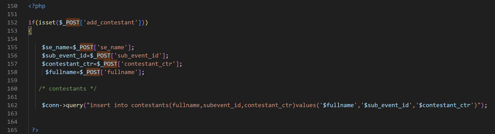
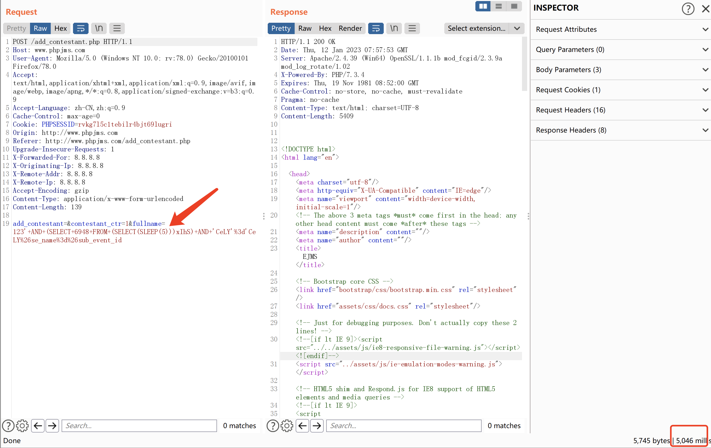
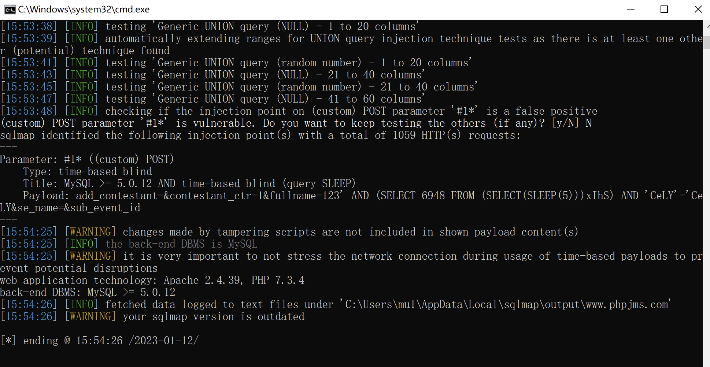

Online Flight Booking Management System add_contestant.php has SQLinject




line: 152 - 162

```
if(isset($_POST['add_contestant']))
{
    
    $se_name=$_POST['se_name'];
    $sub_event_id=$_POST['sub_event_id'];
    $contestant_ctr=$_POST['contestant_ctr'];
     $fullname=$_POST['fullname'];
  
   /* contestants */
   
    $conn->query("insert into contestants(fullname,subevent_id,contestant_ctr)values('$fullname','$sub_event_id','$contestant_ctr')");
    
```

Because the string entered by the user is not filtered and the sql statements are spliced, the sql injection vulnerability is generated. It can cause serious harm to the system.

Maybe because the program does not turn on error display, the joint query cannot be used here, but the sql injection attack can be carried out through the time blind injection method


Use burpsuite for vulnerability verification




Use sqlmap for vulnerability verification



